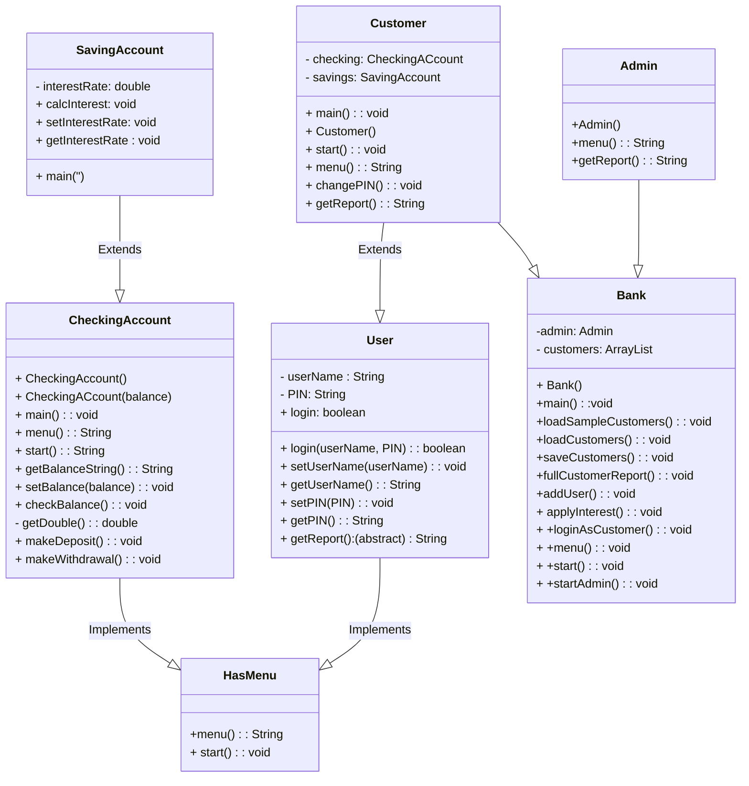

# bankOnit2

```mermaid
classDiagram

class CheckingAccount{
    + CheckingAccount()
    + CheckingACcount(balance)
    + main(): void
    + menu() : String
    + start() : String
    + getBalanceString() : String
    + setBalance(balance) : void 
    + checkBalance() : void
    - getDouble() : double 
    + makeDeposit() : void
    + makeWithdrawal() : void
}

class HasMenu{
    +menu() : String
    + start() : void
}

class SavingAccount{
    - interestRate: double
    + main(")
    + calcInterest: void
    + setInterestRate: void
    + getInterestRate : void
}

class Customer{
    - checking: CheckingACcount
    - savings: SavingAccount
    + main(): void
    + Customer()
    + start() : void
    + menu() : String
    + changePIN(): void
    + getReport(): String
}

class User {
    - userName : String
    - PIN: String

    + login: boolean
    + login(userName, PIN): boolean
    + setUserName(userName): void
    + getUserName(): String
    + setPIN(PIN): void
    + getPIN(): String
    + getReport(): (abstract) String
}

class Bank {
-admin: Admin
- customers: ArrayList

+ Bank()
+main():void
+loadSampleCustomers(): void
+loadCustomers(): void
+saveCustomers(): void
+fullCustomerReport(): void
+addUser(): void
+ applyInterest(): void
+ +loginAsCustomer(): void
+ +menu(): void
+ +start(): void
+ +startAdmin(): void
}

class Admin{
+Admin()
+menu(): String
+getReport(): String
}

SavingAccount --|> CheckingAccount : Extends
CheckingAccount --|> HasMenu : Implements
User --|> HasMenu : Implements
Customer --|> User : Extends

Customer --|> Bank
Admin --|> Bank
```
